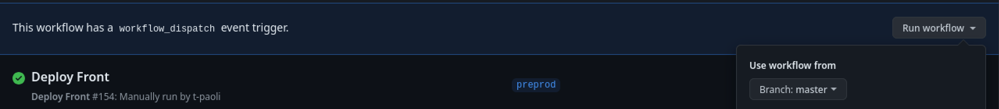

# WestfieldRise

- [WestfieldRise](#westfieldrise)
  - [Start the app](#start-the-app)
  - [Generate code](#generate-code)
  - [Running tasks](#running-tasks)
  - [Want better Editor Integration?](#want-better-editor-integration)
  - [Ready to deploy?](#ready-to-deploy)
  - [Set up CI!](#set-up-ci)
  - [Connect with us!](#connect-with-us)
  - [Deployment](#deployment)
    - [Run a workflow](#run-a-workflow)
      - [Through CLI](#through-cli)
      - [Through the Interface](#through-the-interface)
    - [Configure your env variables](#configure-your-env-variables)
    - [Configure your secrets](#configure-your-secrets)

<a alt="Nx logo" href="https://nx.dev" target="_blank" rel="noreferrer"></a>

✨ **This workspace has been generated by [Nx, a Smart, fast and extensible build system.](https://nx.dev)** ✨

## Start the app

To start the development server run `nx serve westfield_rise`. Open your browser and navigate to http://localhost:4200/. Happy coding!

## Generate code

If you happen to use Nx plugins, you can leverage code generators that might come with it.

Run `nx list` to get a list of available plugins and whether they have generators. Then run `nx list <plugin-name>` to see what generators are available.

Learn more about [Nx generators on the docs](https://nx.dev/plugin-features/use-code-generators).

## Running tasks

To execute tasks with Nx use the following syntax:

```
nx <target> <project> <...options>
```

You can also run multiple targets:

```
nx run-many -t <target1> <target2>
```

..or add `-p` to filter specific projects

```
nx run-many -t <target1> <target2> -p <proj1> <proj2>
```

Targets can be defined in the `package.json` or `projects.json`. Learn more [in the docs](https://nx.dev/core-features/run-tasks).

## Want better Editor Integration?

Have a look at the [Nx Console extensions](https://nx.dev/nx-console). It provides autocomplete support, a UI for exploring and running tasks & generators, and more! Available for VSCode, IntelliJ and comes with a LSP for Vim users.

## Ready to deploy?

Just run `nx build demoapp` to build the application. The build artifacts will be stored in the `dist/` directory, ready to be deployed.

## Set up CI!

Nx comes with local caching already built-in (check your `nx.json`). On CI you might want to go a step further.

- [Set up remote caching](https://nx.dev/core-features/share-your-cache)
- [Set up task distribution across multiple machines](https://nx.dev/core-features/distribute-task-execution)
- [Learn more how to setup CI](https://nx.dev/recipes/ci)

## Connect with us!

- [Join the community](https://nx.dev/community)
- [Subscribe to the Nx Youtube Channel](https://www.youtube.com/@nxdevtools)
- [Follow us on Twitter](https://twitter.com/nxdevtools)

## Deployment

There is 3 workflows that allows to deploy on dev / qa / prod:

- "Deploy Front on Dev" for dev
- "Deploy Front on QA" for qa
- "Deploy Front on Prod" for production

For each pipeline, the workflow is the following:

- Image Build and Push:
  - Authenticate through CICD GCP Service Account
  - Login on Docker Artifact Registry
  - Generate the tag (output)
  - Build locally the image with the correct env variables
  - Test the image with Wiz
  - Push the image
- Deploy on environment:
  - Authenticate through CICD GCP Service Account
  - Get the secrets for the correct environment
  - Deploy the cloud run with the image tag provided in output of the previous job

### Run a workflow

#### Through CLI

Define an env:

```bash
export DEPLOY_ENV=<my env>
```

With the [github cli](https://cli.github.com/), log to github:

```bash
gh auth login
```

To run the pipeline, run the following command

```bash
gh workflow run front-gcp-$DEPLOY_ENV --ref branch/from/to/deploy
```

#### Through the Interface

Go on the [action interface](https://github.com/westfieldcorp/westfieldrise-front-end/actions) and select one of:

- Deploy Front on Dev
- Deploy Front on QA
- Deploy Front on Prod

Then click on Run workflow and select your branch you want to deploy:



### Configure your env variables

Env variables are stored in a folder [.github/cloud-run/](.github/cloud-run/). The files use [.env file](https://nextjs.org/docs/pages/building-your-application/configuring/environment-variables).

For each cloud run and each environment, you have a file name `.<cloud-run name>.<env>` that will contain the environment variable

Example: For rise, the cloud run is called `rise-front` and the .env file associated will be called `.rise-front.dev` and will contain:

```bash
...
CONTENTFUL_ENVIRONMENT=preprod
EN_BREVO_TEMPLATE_ID=69
FR_BREVO_TEMPLATE_ID=72
DE_BREVO_TEMPLATE_ID=71
ES_BREVO_TEMPLATE_ID=70
...
```

### Configure your secrets

Secrets are created through the [gcp-rise-infrastructure](https://github.com/westfieldcorp/gcp-rise-infrastructure) repository. The infrastructure will only create the secret container in GCP secret manager but won't provide any value.
In order to use the secrets, you must go to the GCP console and add a [new version of the secret](https://cloud.google.com/secret-manager/docs/add-secret-version).

You must also configure a secret .env file in the folder [.github/cloud-run/](.github/cloud-run/).
For each cloud run and each environment, you have a file name `.<cloud-run name>.secrets.<env>` that will contain the secrets.

Example: For rise, the cloud run is called `rise-front` and the secret file associated will be called `.rise-front.secrets.dev`

The content of the file should be like:

```bash
<ENV VARIABLE TO BE USED IN THE CONTAINER>=<SECRET NAME IN GCP>:<VERSION OF THE SECRET>
```

Example: If you want to mount the secret `MAILGUN_RISE_API_KEY` in your container as env variable `MAIGUN_API_KEY` with the version `4`, you must have the following line in your secret file:

```bash
MAIGUN_API_KEY=MAILGUN_RISE_API_KEY:4
```

If you want to use the latest version:

```bash
MAIGUN_API_KEY=MAILGUN_RISE_API_KEY:latest
```
